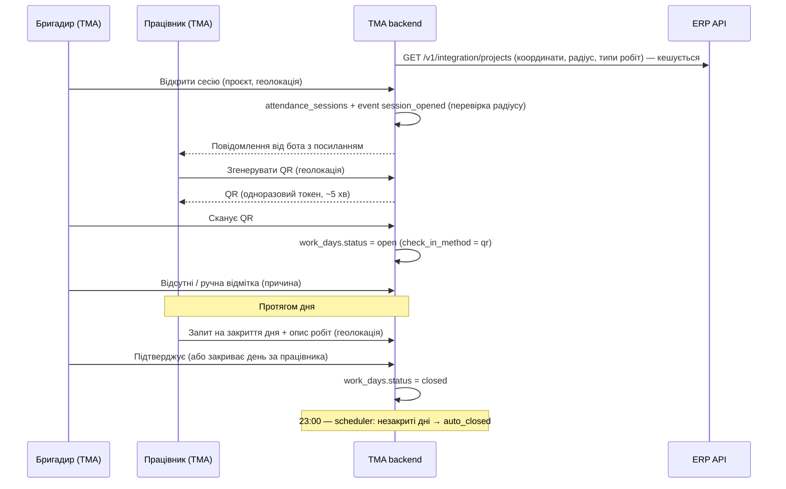
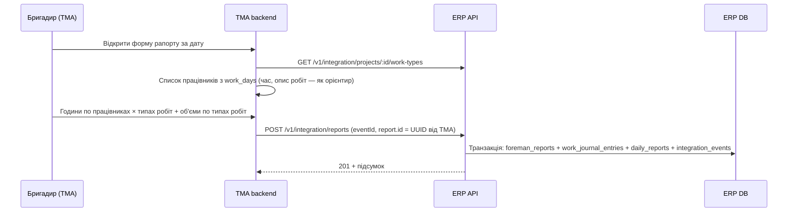
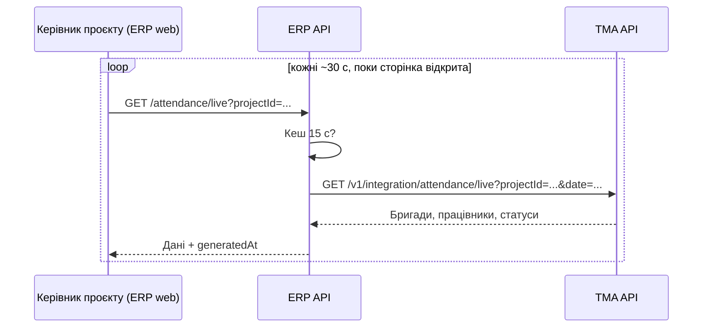
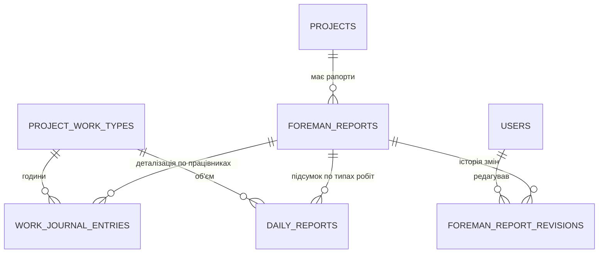

# 📋 Щоденні звіти, журнал робіт та інтеграція з TMA — план реалізації (ERP)

> **Статус:** план / до реалізації. Код ще не змінювався.
> **Пов'язані системи:** ERP (цей репозиторій) і TMA — особистий кабінет працівника на базі Telegram Mini App (окремий фронтенд + бекенд).
> **Схема БД TMA:** ведеться в drawdb.app (`tg_mini_app`), таблиці відміток описані в розділі [9](#9-що-реалізується-на-стороні-tma-довідково).

---

## Зміст

1. [Мета і розподіл відповідальності](#1-мета-і-розподіл-відповідальності)
2. [Ролі та терміни](#2-ролі-та-терміни)
3. [Загальна схема потоків](#3-загальна-схема-потоків)
4. [Зміни в базі даних ERP](#4-зміни-в-базі-даних-erp)
5. [Інтеграційне API ERP (для TMA)](#5-інтеграційне-api-erp-для-tma)
6. [API, яке має надати TMA (live-режим)](#6-api-яке-має-надати-tma-live-режим)
7. [Внутрішні ендпоінти ERP (для фронтенду ERP)](#7-внутрішні-ендпоінти-erp-для-фронтенду-erp)
8. [Бізнес-логіка ERP](#8-бізнес-логіка-erp)
9. [Що реалізується на стороні TMA (довідково)](#9-що-реалізується-на-стороні-tma-довідково)
10. [Безпека](#10-безпека)
11. [Фронтенд ERP](#11-фронтенд-erp)
12. [Етапи реалізації](#12-етапи-реалізації)
13. [Відкриті питання](#13-відкриті-питання)

---

## 1. Мета і розподіл відповідальності

**Мета:** фіксувати фактичну присутність працівників на будові (відкриття/закриття дня), а на її основі — щоденний рапорт бригадира з годинами по кожному працівнику та виконаними об'ємами робіт. Ці дані потрібні для план/факт аналізу проєктів (години, об'єми), а згодом — для фінансового модуля.

| Дані | Де зберігаються | Примітка |
|---|---|---|
| Працівники, бригади, склад бригад | **TMA** | `users`, `brigades`, `employment_periods` |
| Сесії реєстрації, QR-коди, відкриття/закриття дня, геолокація | **TMA** | `attendance_sessions`, `attendance_qr_tokens`, `work_days`, `work_day_events` |
| Проєкти, етапи, типи робіт, плани годин | **ERP** | вже існують |
| Рапорт бригадира (шапка) | **ERP** | нова таблиця `foreman_reports` |
| Журнал робіт (хто / де / що робив / скільки годин) | **ERP** | нова таблиця `work_journal_entries` |
| Підсумок по типу робіт (працівники, години, об'єм) | **ERP** | існуюча `daily_reports` (доопрацювання) |

**Принципи:**

- **Одне джерело правди для кожної сутності.** ERP не копіює відмітки, TMA не зберігає журнал робіт.
- **Працівників в ERP немає і не буде.** ERP зберігає лише зовнішній ідентифікатор (`TMA users.id`) та знімок імені для відображення.
- **Бригада в ERP не зберігається** — склад бригад змінюється часто. Рапорт прив'язується до автора (бригадира), проєкту і дати.
- **Ієрархія в TMA:** керівник проєкту (`brigades.supervisor_id`) → бригадири (`brigades.foreman_id`) → працівники (`employment_periods.brigade_id`). Прямої прив'язки бригади до проєкту немає — проєкт визначається в момент відкриття сесії реєстрації (див. [13](#13-відкриті-питання), п. 1).
- **«Бригадир»** — роль у межах групи, а не посада. Бригадиром може бути будь-який працівник (напр. електрик у сервісній бригаді з 3–4 осіб).

---

## 2. Ролі та терміни

| Термін | Значення |
|---|---|
| **Бригадир** (foreman) | Головний у бригаді. Відкриває сесії реєстрації, сканує QR, підтверджує закриття дня, подає рапорт. Користувач TMA. |
| **Керівник проєкту** (project manager) | `projects.manager_id` в ERP / `brigades.supervisor_id` у TMA. Дивиться live-режим і рапорти в ERP. |
| **Адмін** | Єдина роль, яка може редагувати / видаляти рапорт після відправки (в ERP). |
| **Сесія реєстрації** | Вікно ~5 хв, яке бригадир відкриває на будові; лише в цей час працівники можуть згенерувати QR. |
| **Робочий день** (`work_day`) | Стан працівника на дату в TMA: `open`, `close_requested`, `closed`, `auto_closed`, `absent`. Відсутність запису = «не відмічений». |
| **Рапорт** (`foreman_report`) | Подання бригадира за день по одному проєкту. За один день по одному проєкту і типу робіт може бути **кілька** рапортів (різні бригади). |
| **Журнал робіт** (`work_journal_entries`) | Деталізація рапорту: працівник × тип робіт × години. |
| **Підсумок** (`daily_reports`) | Агрегат рапорту по типу робіт: кількість працівників, сума годин, виконаний об'єм. Рахується з журналу автоматично (крім об'єму). |

---

## 3. Загальна схема потоків

### 3.1 Відкриття / закриття дня (повністю в TMA)



### 3.2 Рапорт бригадира (TMA → ERP)



### 3.3 Live-режим керівника проєкту (ERP ← TMA)



> Live-режим **не зберігає** відмітки в ERP — ERP лише проксіює запит до TMA (з кешем). Обґрунтування — у [8.6](#86-live-режим).

---

## 4. Зміни в базі даних ERP

Конвенції як у чинній схемі: `snake_case`, UUID з `gen_random_uuid()`, `Timestamptz(0)`, гроші/кількості — `Decimal`, soft delete через `deleted_at`.

### 4.1 `foreman_reports` — рапорт бригадира (нова)

| Колонка | Тип | Обмеження | Опис |
|---|---|---|---|
| `id` | `uuid` | PK | **Генерує TMA** при створенні чернетки рапорту. Слугує ключем ідемпотентності. |
| `project_id` | `uuid` | FK → `projects.id`, NOT NULL | |
| `report_date` | `date` | NOT NULL | Дата робіт. |
| `author_external_id` | `varchar(64)` | NOT NULL | `TMA users.id` бригадира. |
| `author_name` | `varchar(255)` | NOT NULL | Знімок імені на момент подання (для відображення в ERP). |
| `comment` | `text` | NULL | Загальний коментар бригадира. |
| `submitted_at` | `timestamptz` | NOT NULL | Час подання в TMA. |
| `source` | `varchar(20)` | NOT NULL, default `'tma'` | На майбутнє (імпорт, ручне введення). |
| `created_at` | `timestamptz` | default `now()` | |
| `updated_at` | `timestamptz` | default `now()` | |
| `updated_by` | `int` | FK → `users.id`, NULL | Адмін, який останнім редагував. |
| `deleted_at` | `timestamptz` | NULL | Soft delete (лише адмін). |

Індекси: `(project_id, report_date)`, `(author_external_id, report_date)`.

### 4.2 `work_journal_entries` — журнал робіт (нова)

| Колонка | Тип | Обмеження | Опис |
|---|---|---|---|
| `id` | `uuid` | PK | |
| `report_id` | `uuid` | FK → `foreman_reports.id` ON DELETE CASCADE, NOT NULL | |
| `project_id` | `uuid` | FK → `projects.id`, NOT NULL | Денормалізація для звітів (= `foreman_reports.project_id`). |
| `work_date` | `date` | NOT NULL | Денормалізація (= `foreman_reports.report_date`). |
| `work_type_id` | `uuid` | FK → `project_work_types.id`, NOT NULL | |
| `worker_external_id` | `varchar(64)` | NOT NULL | `TMA users.id` працівника. |
| `worker_name` | `varchar(255)` | NOT NULL | Знімок імені. |
| `work_day_external_id` | `uuid` | NULL | `TMA work_days.id` — зв'язок з відміткою (для звірки). |
| `hours` | `decimal(5,2)` | NOT NULL, CHECK `hours > 0 AND hours <= 24` | |
| `created_at`, `updated_at` | `timestamptz` | default `now()` | |
| `deleted_at` | `timestamptz` | NULL | Ставиться разом із soft delete рапорту. |

Обмеження: `UNIQUE (report_id, worker_external_id, work_type_id)`.
Індекси: `(project_id, work_date)`, `(worker_external_id, work_date)`, `(work_type_id)`.

> Один працівник за день може працювати над кількома типами робіт → кілька рядків у межах рапорту.

### 4.3 `daily_reports` — підсумок по типу робіт (доопрацювання існуючої)

Таблиця вже використовується для розрахунку фактичного прогресу типу робіт (`ProjectsService.listWorkTypes` сумує `actual_quantity`), тому назва і наявні колонки зберігаються.

| Зміна | Колонка | Тип | Опис |
|---|---|---|---|
| ➕ | `report_id` | `uuid` FK → `foreman_reports.id` ON DELETE CASCADE, NOT NULL | Спільний ідентифікатор рапорту з журналом. |
| ➕ | `created_at`, `updated_at` | `timestamptz` default `now()` | |
| ⏺ | `project_id`, `report_date`, `work_type_id` | без змін | Заповнюються з рапорту. |
| ⏺ | `actual_workers` | без змін | = кількість **унікальних** працівників на типі робіт у рапорті (рахує ERP). |
| ⏺ | `actual_hours` | без змін | = сума годин з журналу (рахує ERP). |
| ⏺ | `actual_quantity` | без змін | Об'єм, який вказує бригадир (в одиницях `project_work_types.unit`). |
| ⏺ | `deleted_at` | без змін | |

Обмеження: `UNIQUE (report_id, work_type_id)`.
Індекс: `(project_id, report_date)`.

**Міграція:** API для `daily_reports` ще не було, тож таблиця має бути порожньою. Перед міграцією — перевірити (`SELECT count(*) FROM daily_reports`); якщо є тестові рядки — видалити, після чого додати `report_id NOT NULL`.

> Колонку автора в `daily_reports` не додаємо — автор зберігається в шапці `foreman_reports` (один раз на рапорт, без дублювання).

### 4.4 `foreman_report_revisions` — історія редагувань (нова, рекомендовано)

Оскільки редагувати рапорт може лише адмін, корисно зберігати, що саме було до зміни.

| Колонка | Тип | Опис |
|---|---|---|
| `id` | `uuid` PK | |
| `report_id` | `uuid` FK → `foreman_reports.id` ON DELETE CASCADE | |
| `revision_no` | `int` | 1, 2, 3… |
| `snapshot` | `jsonb` | Повний стан рапорту **до** зміни (works + journal). |
| `reason` | `text` NOT NULL | Причина редагування / видалення. |
| `changed_by` | `int` FK → `users.id` | |
| `changed_at` | `timestamptz` default `now()` | |

Обмеження: `UNIQUE (report_id, revision_no)`.

### 4.5 `integration_events` — журнал вхідних подій (нова)

Аналог `finance_events` у TMA.

| Колонка | Тип | Опис |
|---|---|---|
| `id` | `bigserial` PK | |
| `event_id` | `varchar(64)` UNIQUE | Генерує TMA (UUID). |
| `event_type` | `varchar(40)` | `report.created` (на майбутнє — інші). |
| `entity_id` | `uuid` NULL | Напр. `foreman_reports.id`. |
| `status` | `varchar(20)` | `processed` / `rejected`. |
| `response` | `jsonb` NULL | Відповідь, яку повертаємо при повторі того ж `event_id`. |
| `error` | `text` NULL | |
| `received_at` | `timestamptz` default `now()` | |

### 4.6 `projects` — нова колонка

| Колонка | Тип | Опис |
|---|---|---|
| `geofence_radius_m` | `int` NULL | Радіус (м) навколо `latitude`/`longitude` для перевірки геолокації в TMA. `NULL` → TMA використовує значення за замовчуванням. |

### 4.7 `users` — зв'язок керівника проєкту з TMA (потребує рішення)

| Колонка | Тип | Опис |
|---|---|---|
| `tma_user_id` | `varchar(64)` UNIQUE NULL | `TMA users.id` цього користувача ERP. |

Потрібна, щоб TMA могла показати бригадиру проєкти **його** керівника (`brigades.supervisor_id` → ERP `projects.manager_id`). Альтернатива — зіставлення за номером телефону. Див. [13](#13-відкриті-питання), п. 1.

### 4.8 ERD (нові зв'язки)



---

## 5. Інтеграційне API ERP (для TMA)

**Базовий шлях:** `/v1/integration`
**Автентифікація:** один спільний ключ у заголовку `x-api-key` (`INTEGRATION_API_KEY`), перевірка — існуючий `ApiKeyGuard`.
**Формат:** JSON, `camelCase` (як у чинному `/v1/integration/projects`). Дати — `YYYY-MM-DD`, час — ISO 8601 з часовою зоною.

### 5.1 `GET /v1/integration/projects` — доопрацювання існуючого

Що змінити:

- **Додати в відповідь** `location.latitude`, `location.longitude`, `geofenceRadiusM`, `pinUrl` — потрібні TMA для перевірки геолокації.
- **Фільтри (query):**
  - `status` — напр. `ACTIVE` (за замовчуванням повертати лише `ACTIVE`; зараз повертаються всі не видалені);
  - `managerExternalId` — лише проєкти керівника з `users.tma_user_id = :managerExternalId` (для вибору проєкту бригадиром).
- **Розглянути полегшену відповідь** для списку (без `financials`, `plannedExpenses`): TMA фінансові дані не потрібні.

### 5.2 `GET /v1/integration/projects/:projectId/work-types` — новий

Список типів робіт для форми рапорту.

```json
[
  {
    "id": "6f0c…",
    "name": "Wbijanie pali",
    "unit": "szt",
    "department": { "id": 1, "name": "Kafar" },
    "milestoneNo": "KM1",
    "totalQuantity": 4200,
    "actualQuantity": 1830.5,
    "plannedStart": "2026-09-01",
    "plannedEnd": "2026-10-31"
  }
]
```

Лише не видалені типи робіт (`deleted_at IS NULL`). `actualQuantity` — сума `daily_reports.actual_quantity` (не видалених).

### 5.3 `POST /v1/integration/reports` — подання рапорту

**Тіло запиту:**

```json
{
  "eventId": "0b8f3c1e-…",
  "report": {
    "id": "a3e1…",
    "projectId": "1c2d…",
    "reportDate": "2026-10-09",
    "submittedAt": "2026-10-09T17:42:10+02:00",
    "author": { "externalId": "123", "name": "Jan Kowalski" },
    "comment": "Opóźnienie dostawy kabli",
    "works": [
      { "workTypeId": "6f0c…", "quantity": 120 },
      { "workTypeId": "9a7b…", "quantity": 0 }
    ],
    "journal": [
      {
        "worker": { "externalId": "456", "name": "Piotr Nowak" },
        "workDayId": "d4e5…",
        "entries": [
          { "workTypeId": "6f0c…", "hours": 6 },
          { "workTypeId": "9a7b…", "hours": 2 }
        ]
      }
    ]
  }
}
```

**Відповіді:**

| Код | Коли | Тіло |
|---|---|---|
| `201 Created` | Рапорт створено | `{ "id", "status": "created", "summary": [{ "workTypeId", "workers", "hours", "quantity" }] }` |
| `200 OK` | Повтор того самого `eventId` | Та сама відповідь, що й при першій обробці (з `integration_events.response`) |
| `409 Conflict` | Рапорт з таким `report.id` вже існує (інший `eventId`) | `{ "code": "REPORT_ALREADY_EXISTS" }` — змінювати рапорт може лише адмін в ERP |
| `422 Unprocessable Entity` | Помилки валідації | `{ "code": "VALIDATION_FAILED", "errors": [{ "path": "journal[0].entries[1].workTypeId", "code": "WORK_TYPE_NOT_IN_PROJECT" }] }` |
| `401` | Немає / невірний ключ | |

Правила валідації — у [8.1](#81-прийом-рапорту-post-v1integrationreports).

### 5.4 `GET /v1/integration/reports` — список рапортів

Для TMA: показати бригадиру подані рапорти і не дати подати дублікат.

Query: `projectId`, `dateFrom`, `dateTo`, `authorExternalId` (усі опціональні, але хоча б один обов'язковий).

```json
[
  {
    "id": "a3e1…",
    "projectId": "1c2d…",
    "reportDate": "2026-10-09",
    "author": { "externalId": "123", "name": "Jan Kowalski" },
    "submittedAt": "2026-10-09T17:42:10+02:00",
    "updatedAt": "2026-10-09T17:42:10+02:00",
    "isEdited": false,
    "totals": { "workers": 6, "hours": 48 }
  }
]
```

### 5.5 `GET /v1/integration/reports/:id` — один рапорт

Повна структура (`works` + `journal` у форматі запиту з 5.3) + `isEdited`, `updatedAt`. Видалений рапорт → `404`.

---

## 6. API, яке має надати TMA (live-режим)

ERP викликає TMA для live-режиму керівника проєкту. Ключ — той самий спільний секрет (заголовок `x-api-key`); в ERP — змінні `TMA_API_URL`, `TMA_API_KEY`.

### `GET /v1/integration/attendance/live`

Query (хоча б один із перших двох):

| Параметр | Опис |
|---|---|
| `projectId` | Бригади, які **сьогодні** працюють на цьому проєкті (за `attendance_sessions.project_id` / `work_days.project_id`). |
| `managerExternalId` | Усі бригади керівника (`brigades.supervisor_id`), включно з тими, що ще не відкрили сесію. |
| `date` | За замовчуванням — сьогодні (Europe/Warsaw). |

**Відповідь (контракт, який очікує ERP):**

```json
{
  "date": "2026-10-09",
  "generatedAt": "2026-10-09T09:15:03+02:00",
  "brigades": [
    {
      "id": 12,
      "name": "Kafar 1",
      "projectId": "1c2d…",
      "foreman": { "externalId": "123", "name": "Jan Kowalski" },
      "lastSessionAt": "2026-10-09T07:02:11+02:00",
      "members": [
        {
          "externalId": "456",
          "name": "Piotr Nowak",
          "position": "Monter",
          "status": "open",
          "checkInAt": "2026-10-09T07:03:40+02:00",
          "checkInMethod": "qr",
          "manualReason": null,
          "absenceReason": null,
          "absenceComment": null,
          "closeRequestedAt": null,
          "closedAt": null,
          "closeMethod": null,
          "workDescription": null,
          "distanceToSiteM": 85
        }
      ],
      "totals": { "members": 8, "present": 6, "absent": 1, "notMarked": 1, "closed": 0 }
    }
  ],
  "totals": { "members": 8, "present": 6, "absent": 1, "notMarked": 1, "closed": 0 }
}
```

- `status`: `not_marked` | `open` | `close_requested` | `closed` | `auto_closed` | `absent`.
- `projectId` бригади — проєкт останньої сесії за дату; `null`, якщо сесії ще не було.
- `absenceReason`: `{ "code": "sick", "name": "Choroba" }` або `null`.

---

## 7. Внутрішні ендпоінти ERP (для фронтенду ERP)

Усі — під JWT (див. [10](#10-безпека)), з перевіркою ролей.

| Метод | Шлях | Ролі | Опис |
|---|---|---|---|
| `GET` | `/attendance/live?projectId=` / `?mine=true` | admin, operational_director, project_manager (лише свої проєкти) | Проксі до TMA (6) з кешем. `mine=true` → по `tma_user_id` поточного користувача. |
| `GET` | `/projects/:projectId/reports?dateFrom=&dateTo=&authorExternalId=` | admin, operational_director, project_manager, financial_director, viewer | Список рапортів проєкту. |
| `GET` | `/reports/:id` | ті ж | Рапорт з журналом, підсумком та історією редагувань. |
| `PUT` | `/reports/:id` | **admin** | Повна заміна `works` + `journal` + обов'язкове `reason`. |
| `DELETE` | `/reports/:id` | **admin** | Soft delete з обов'язковим `reason`. |
| `GET` | `/projects/:projectId/work-journal?dateFrom=&dateTo=&workerExternalId=&workTypeId=` | admin, operational_director, project_manager, financial_director | Журнал робіт з фільтрами (для аналізу і експорту). |
| `GET` | `/projects/:projectId/work-types/progress` | ті ж | План/факт по типах робіт: об'єм (`total_quantity` vs сума `actual_quantity`), години (план vs сума журналу). |

---

## 8. Бізнес-логіка ERP

### 8.1 Прийом рапорту (`POST /v1/integration/reports`)

**Ідемпотентність:**

1. Якщо `eventId` вже є в `integration_events` → повернути збережену `response` (200), нічого не робити.
2. Якщо `report.id` вже є в `foreman_reports` (з іншим `eventId`) → `409 REPORT_ALREADY_EXISTS`.

**Валідація (усі помилки збираються в один `422`):**

| # | Правило | Код помилки |
|---|---|---|
| 1 | Проєкт існує, `deleted_at IS NULL`, `status = 'ACTIVE'` | `PROJECT_NOT_FOUND` / `PROJECT_NOT_ACTIVE` |
| 2 | `reportDate` не в майбутньому (Europe/Warsaw) і не старше N днів (налаштування `REPORT_MAX_AGE_DAYS`, напр. 7) | `REPORT_DATE_INVALID` |
| 3 | Кожен `workTypeId` належить проєкту і не видалений | `WORK_TYPE_NOT_IN_PROJECT` |
| 4 | `journal` не порожній; у кожного працівника ≥ 1 запис | `JOURNAL_EMPTY` |
| 5 | `hours` > 0, ≤ 24, кратні 0.25 | `HOURS_INVALID` |
| 6 | Немає дублікатів (працівник × тип робіт) у межах рапорту | `DUPLICATE_ENTRY` |
| 7 | Сума годин працівника за дату **по всіх не видалених рапортах** (разом із цим) ≤ 24 | `WORKER_HOURS_EXCEEDED` |
| 8 | Множина типів робіт у `works` = множина типів робіт у `journal` (на кожен тип робіт з годинами — рівно один запис об'єму, і навпаки) | `WORKS_JOURNAL_MISMATCH` |
| 9 | `quantity` ≥ 0 | `QUANTITY_INVALID` |
| 10 | Немає дублікатів `workTypeId` у `works` | `DUPLICATE_WORK_TYPE` |

**Попередження (не блокують, повертаються в `warnings`):**

- сумарний фактичний об'єм типу робіт перевищує `total_quantity`;
- `reportDate` поза `planned_start`…`planned_end` типу робіт.

**Збереження — одна транзакція:**

1. `INSERT foreman_reports`.
2. `INSERT work_journal_entries` (по рядку на кожен `entries[]`, з `project_id`, `work_date` з шапки).
3. Для кожного типу робіт — `INSERT daily_reports`:
   - `actual_workers` = `COUNT(DISTINCT worker_external_id)` по журналу цього рапорту і типу робіт;
   - `actual_hours` = `SUM(hours)`;
   - `actual_quantity` = `works[].quantity`.
4. `INSERT integration_events` (`status = processed`, `response` = тіло відповіді).

Підсумок у `daily_reports` рахується **виключно на сервері** з журналу — TMA не надсилає суми, тому розбіжності між журналом і підсумком неможливі.

### 8.2 Редагування рапорту адміном (`PUT /reports/:id`)

1. Перевірити роль `admin`, рапорт не видалений, `reason` не порожній.
2. Валідувати нові `works` + `journal` за правилами 8.1 (п. 3–10; у п. 7 — без урахування поточної версії цього рапорту).
3. В одній транзакції:
   - записати поточний стан у `foreman_report_revisions` (наступний `revision_no`);
   - видалити старі `work_journal_entries` і `daily_reports` цього рапорту;
   - вставити нові (так само, як у 8.1, кроки 2–3);
   - оновити `foreman_reports.updated_at`, `updated_by`.

Змінювати `project_id`, `report_date`, автора не дозволяється (у такому разі — видалити рапорт і попросити бригадира подати новий).

### 8.3 Видалення рапорту (`DELETE /reports/:id`)

Soft delete: в одній транзакції `deleted_at = now()` для `foreman_reports`, його `work_journal_entries` і `daily_reports` + запис у `foreman_report_revisions` з `reason`. Видалені рапорти не враховуються ні в прогресі, ні в ліміті 24 год.

### 8.4 Вплив на прогрес робіт (існуючий код)

- `ProjectsService.listWorkTypes` уже сумує `daily_reports.actual_quantity` з фільтром `deleted_at: null` — після змін працює без доопрацювань, але варто винести розрахунок у спільний метод (його також використовує 5.2 і 7).
- Дашборд проєкту (`ProjectDashboardTab`) отримує реальний факт замість моків.

### 8.5 План/факт годин

- **План по типу робіт** = `project_hours_plan.planned_hours_total × work_type_hours_distribution.percentage / 100`.
- **Факт** = `SUM(work_journal_entries.hours)` по типу робіт (не видалені).
- ⚠️ API для `project_hours_plan` і `work_type_hours_distribution` (Крок 3 ТЗ) ще не реалізоване — до того часу показуємо лише факт годин і план/факт об'ємів.

### 8.6 Live-режим

**Чому проксі, а не копія відміток в ERP:**

- відмітки живуть у TMA — копія в ERP означала б синхронізацію, порядок подій, повтори;
- лише TMA знає **повний склад бригади**, тож лише вона може показати «не відмічених»;
- той самий ендпоінт TMA можна показувати й в інших сервісах.

**Реалізація в ERP:**

- `AttendanceModule` з `TmaClient` (`@nestjs/axios`, вже є в залежностях): таймаут 5 с, заголовок `x-api-key`.
- Кеш відповіді на 15 с за ключем `(projectId | managerExternalId, date)` — в Redis (вже є в стеку) або в пам'яті. Захищає TMA, коли кілька людей одночасно дивляться один проєкт.
- Права: `project_manager` бачить лише проєкти, де `projects.manager_id = currentUser.id`; admin / operational_director — усі.
- Якщо TMA недоступна → `502` з `{ "code": "TMA_UNAVAILABLE" }`; фронтенд показує останні отримані дані з позначкою часу.
- Фронтенд опитує кожні ~30 с лише поки вкладка активна (`refetchInterval` + `refetchIntervalInBackground: false` у TanStack Query).

### 8.7 Час і дати

- «Сьогодні» і перевірки дат рахуються в зоні **Europe/Warsaw** (нічних змін немає).
- `report_date` / `work_date` — тип `date`, без часу.
- На майбутнє, для проєктів поза Польщею, можна додати `projects.timezone`.

---

## 9. Що реалізується на стороні TMA (довідково)

Таблиці (схема в drawdb.app):

| Таблиця | Призначення |
|---|---|
| `absence_reasons` | Довідник причин відсутності (`code`, `name`, `requires_comment`). |
| `attendance_sessions` | Сесія реєстрації бригадира (~5 хв), `project_id` = ERP `projects.id`. |
| `attendance_qr_tokens` | Одноразові QR-токени (у БД — лише хеш). |
| `work_days` | Стан дня працівника: `open` / `close_requested` / `closed` / `auto_closed` / `absent`. Унікальність `(user_id, work_date)`. |
| `work_day_events` | Журнал дій (append-only) з геолокацією: `session_opened`, `qr_generated`, `qr_scanned`, `manual_check_in`, `marked_absent`, `close_requested`, `close_confirmed`, `close_rejected`, `closed_by_foreman`, `auto_closed`, `admin_corrected`. |

Логіка, від якої залежить ERP:

- **Геолокація** — при відкритті сесії, генерації QR і закритті дня; відстань рахується до `latitude`/`longitude` проєкту з ERP, радіус — `geofenceRadiusM` (або значення за замовчуванням).
- **Правило часу QR:** згенерувати — поки сесія відкрита; відсканувати — поки дійсний токен.
- **Автозакриття о 23:00** (scheduler) → `auto_closed`; наступного дня керівник проєкту з бригадиром розбираються.
- **Форма рапорту:** TMA бере працівників з `work_days` за дату (час початку/кінця, `work_description` — як орієнтир), бригадир розподіляє години по типах робіт (з 5.2) і вказує об'єми, після чого TMA викликає 5.3. `report.id` генерується **один раз** при створенні чернетки і не змінюється при повторних спробах відправки.
- **Ендпоінт live** — контракт у розділі [6](#6-api-яке-має-надати-tma-live-режим).

---

## 10. Безпека

> ⚠️ **Важливо:** зараз більшість контролерів ERP (`/projects`, `/users`, `/contractors`, …) **не перевіряють JWT** — ролі обмежуються лише у фронтенді. Нові ендпоінти розділу 7 не можна відкривати без захисту.

Що зробити в межах цього блоку:

1. **`JwtAuthGuard` + `RolesGuard`** (декоратор `@Roles(...)`) — застосувати до нових контролерів; окремою задачею — до всіх існуючих.
2. **`ApiKeyGuard`** — порівнювати ключ через `crypto.timingSafeEqual` замість `!==`.
3. **Ключі** — `INTEGRATION_API_KEY` (вхідні запити від TMA) і `TMA_API_KEY` (вихідні до TMA) — можна один і той самий секрет, але дві змінні, щоб у майбутньому розділити без змін у коді.
4. **Логування** інтеграційних запитів (метод, шлях, `eventId`, статус, час) без тіла з персональними даними.
5. **Мінімізація даних:** інтеграційний API не повинен віддавати TMA фінансові дані проєкту (див. 5.1).

---

## 11. Фронтенд ERP

| Місце | Що показуємо |
|---|---|
| **Live-режим** (окремий розділ навігації + вкладка в `ProjectDetailsDrawer`) | Бригади → працівники зі статусами; лічильники `present / absent / notMarked / closed`; час останнього оновлення; позначки ручних відміток і великої відстані до будови. |
| **Вкладка «Raporty dzienne»** у `ProjectDetailsDrawer` | Список рапортів за період (дата, бригадир, працівники, години), розгортання → підсумок по типах робіт і журнал по працівниках; для адміна — редагування/видалення з причиною та історія змін. |
| **Вкладка Works / Dashboard** | Фактичний об'єм і години по типах робіт з реальних даних (замість моків). |
| **Журнал робіт** | Таблиця з фільтрами (період, працівник, тип робіт) + експорт (CSV / Google Sheets, як уже є для проєктів). |

---

## 12. Етапи реалізації

| # | Етап | Залежить від |
|---|---|---|
| 1 | **Безпека:** `JwtAuthGuard`, `RolesGuard`, `timingSafeEqual` в `ApiKeyGuard` | — |
| 2 | **Міграція БД:** `foreman_reports`, `work_journal_entries`, зміни `daily_reports`, `foreman_report_revisions`, `integration_events`, `projects.geofence_radius_m`, `users.tma_user_id` | рішення з 13 |
| 3 | **Інтеграційне API для довідників:** доопрацювання `GET /projects` (5.1), `GET /projects/:id/work-types` (5.2) | 2 |
| 4 | **Прийом рапортів:** `POST /reports` з валідацією, ідемпотентністю, транзакцією; `GET /reports`, `GET /reports/:id` | 2 |
| 5 | **Внутрішні ендпоінти рапортів:** список, перегляд, редагування / видалення адміном з ревізіями | 1, 4 |
| 6 | **Live-режим:** `TmaClient`, кеш, `GET /attendance/live` | 1, ендпоінт TMA (6) |
| 7 | **Фронтенд:** вкладка рапортів, live-режим, факт у Works/Dashboard, журнал робіт | 5, 6 |
| 8 | **Тести:** unit — валідація і розрахунок підсумку; e2e — повний цикл `POST` → прогрес типу робіт, повтор `eventId`, конфлікт `report.id`, ліміт 24 год | 4, 5 |
| 9 | **Документація:** оновити `business_workflows.md`, `database_schema.md`, `PROJECT.md` (Крок 5 → 🟢) | 7 |

Етапи 3–4 можна віддати TMA для інтеграції раніше, ніж буде готовий фронтенд ERP.

---

## 13. Відкриті питання

1. **Вибір проєкту при відкритті сесії.** Бригада не прив'язана до проєкту, тож бригадир обирає проєкт зі списку проєктів свого керівника. Для цього треба зіставити `TMA brigades.supervisor_id` з ERP `projects.manager_id`:
   - **варіант А (рекомендовано):** `users.tma_user_id` в ERP, заповнюється адміном;
   - **варіант Б:** зіставлення за номером телефону (є в обох системах, але менш надійно).
2. **Статус проєкту для рапортів.** Поки життєвий цикл статусів (ТЗ 4.11) не реалізований, приймаємо рапорти лише для `ACTIVE`. Чи потрібно дозволяти рапорти для `ON_HOLD` (напр. роботи з консервації)?
3. **Глибина подання рапорту в минуле** (`REPORT_MAX_AGE_DAYS`) — 7 днів підходить?
4. **Крок годин** — 0.25 год (15 хв) чи 0.5 год?
5. **Обов'язковість рапорту.** Чи має ERP/TMA нагадувати бригадиру, якщо рапорт за день не подано (а працівники були відмічені)?
6. **Радіус за замовчуванням** для геолокації, якщо `geofence_radius_m` не задано.
