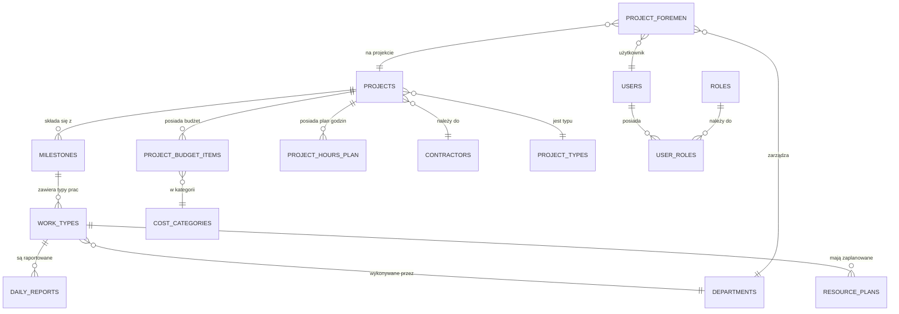

# 🗄️ Schemat Bazy Danych (Database Schema)

Architektura bazy danych opiera się na **PostgreSQL 15+** i została zaprojektowana pod kątem wydajności, wymogu zachowania historii i integralności wielowalutowych danych finansowych dla różnych typów projektów budowlanych.

---

## 🏛️ Główne Koncepcje

### 1. Elastyczność Typów Projektów
Nie chcemy tworzyć osobnych tabel dla różnego rodzaju projektów (jak PV czy BESS). Główne informacje (Nazwa, Kontrahent) leżą bezpośrednio w tabeli `projects`. Pola specyficzne dla danego typu trzymane są jako obiekt JSON w kolumnie `custom_fields JSONB` z mocną walidacją na etapie zapisu.

### 2. Słowniki Danych (Dictionaries)
Kluczowe słowniki:
*   `roles`, `users`
*   `departments` (np. Kafar, Montaż, Elektryka, Maszyny)
*   `cost_categories` (Kategorie kosztów: np. Transport, Materiały, Wynagrodzenia).

### 3. Logiczne "Miękkie Usuwanie" (Soft Delete)
Kluczowe encje, jak Projekty, Faktury, Raporty Dzienne, nigdy nie są trwale usuwane, by zapobiec zniszczeniu archiwalnej dokumentacji księgowej. Używamy wbudowanego mechanizmu `deleted_at`.

### 4. Pieniądze i Waluty
W celu zachowania dokładności, kwoty są przechowywane jako `NUMERIC(15,2)`, a procenty jako `NUMERIC(5,2)`. Waluta jest zdefiniowana na poziomie `projects`, co oznacza, że cały budżet danego projektu oraz jego fakturowanie odbywają się wyłącznie w jednej walucie głównej projektu.

---

## 🗺️ Diagram ERD (Core)

Poniżej uproszczony diagram struktury kluczowych tabel związanych z projektem.

## 📝 Cykl Rozliczania Czasu (The Core Chain)

Aby planowanie godzin miało sens, opiera się na wyliczaniu kaskadowym:

1.  **Dyrektor definiuje:** W tabeli `project_budget_items` zapisuje pozycję kategorii `Zarobki` z konkretną sumą.
2.  **Wyliczenie puli godzin:** Powstaje encja `project_hours_plan`, gdzie całkowity fundusz dzieli się przez ustaloną stawkę godzinową pracownika.
3.  **Dystrybucja:** W tabeli `work_type_hours_distribution`, Dyrektor Operacyjny (po dodaniu zakresu robót przez Managera) rozdysponowuje tą pulę pomiędzy konkretnymi robociznami (`WORK_TYPES`).
